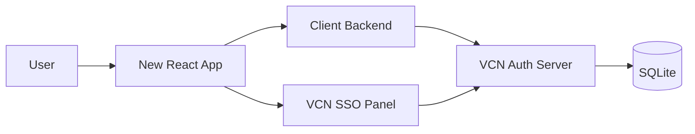

# VCN Auth Integration Guide

Ten poradnik jest dla developerów, którzy chcą podłączyć nową aplikację do istniejącego systemu logowania VCN, a nie budować własny auth od zera.

System składa się z trzech elementów:

- centralny panel logowania i administracji,
- auth server, który wydaje login session i authorization code,
- backend aplikacji klienta, który wymienia code na token i trzyma sesję w `httpOnly` cookie.

## Co już istnieje po stronie VCN

Masz już gotowe:

- panel logowania pod `http://localhost:5173`,
- panel administratora z użytkownikami, aplikacjami i permissions,
- auth server pod `http://localhost:4000` z endpointami `POST /api/auth/login`, `POST /api/auth/authorize`, `POST /api/auth/token`, `GET /api/auth/me`, `POST /api/auth/logout`,
- endpointy admina pod `GET/POST/DELETE /api/admin/users`, `GET/POST/DELETE /api/admin/apps`, `GET/POST/DELETE /api/admin/permissions`,
- backend klienta z `/api/auth/exchange`, `/api/auth/me` i `/api/auth/logout`,
- logowanie oparte o `httpOnly` cookies i JWT.

Twoja nowa aplikacja ma się do tego tylko podłączyć.

## Docelowy przepływ integracji



## 1. Ustal, co jest po stronie nowej aplikacji

Nowa aplikacja powinna mieć dwa osobne poziomy:

- frontend React,
- backend Express.

Frontend pokazuje przycisk `Sign in with VCN` i ekran po zalogowaniu.
Backend robi wymianę `code -> token` i zapisuje token w cookie.

## 2. Zarejestruj nową aplikację w panelu admina

Zanim podłączysz kod, trzeba dodać aplikację w systemie VCN.

### 2.1. Wejdź do panelu admina

Otwórz panel SSO i przejdź do:

- `http://localhost:5173/admin/apps`

Do lokalnych testów masz też zasiane konta:

- `admin@example.com` / `Password123!`
- `user@example.com` / `Password123!`

### 2.2. Dodaj aplikację

W formularzu ustaw:

- nazwę aplikacji,
- dozwolony redirect URI,
- sekret aplikacji.

Redirect URI musi dokładnie zgadzać się z callbackiem w nowej aplikacji, np.:

```text
http://localhost:5174/callback
```

### 2.3. Dodaj użytkowników i permissions

Przejdź do:

- `http://localhost:5173/admin/users`
- `http://localhost:5173/admin/permissions`

Dodaj:

- konto użytkownika,
- przypisanie do aplikacji,
- rolę, np. `viewer`, `editor`, `admin`.

Bez permission użytkownik nie powinien dostać code do tej aplikacji.

## 3. Skonfiguruj backend nowej aplikacji

Backend nowej aplikacji powinien znać trzy rzeczy:

- URL auth servera,
- secret aplikacji,
- cookie name, pod którym zapisujesz token.

### 3.1. Przykładowe zmienne środowiskowe

```env
AUTH_SERVER_URL=http://localhost:4000
CLIENT_SECRET_KEY=twoj-sekret-aplikacji
JWT_SECRET=twoj-sekret-do-cookie
FRONTEND_ORIGIN=http://localhost:5174
CLIENT_APP_ID=1
```

### 3.2. Co backend ma umieć

Backend powinien mieć:

- endpoint do wymiany code na token,
- endpoint do sprawdzenia zalogowanego usera,
- endpoint logout.

## 4. Skonfiguruj frontend nowej aplikacji

Frontend nie powinien znać sekretu aplikacji. On tylko:

- pokazuje ekran startowy,
- przekierowuje do panelu VCN,
- odbiera `code` na callbacku,
- czyta status sesji z backendu,
- pozwala się wylogować.

### 4.1. Wymagane trasy

Najprościej mieć:

- `/` - landing page,
- `/callback` - odbiór `code`,
- `/me` lub ekran po zalogowaniu,
- `/logout` jako akcję UI, niekoniecznie osobną trasę.

## 5. Zaimplementuj login w nowej aplikacji

### 5.1. Dodaj przycisk logowania

Na stronie startowej dodaj przycisk:

```text
Sign in with VCN
```

Ten przycisk prowadzi do panelu VCN z parametrami `appId` i `redirectUri`.

Przykład:

```text
http://localhost:5173/login?appId=2&redirectUri=http://localhost:5174/callback
```

### 5.2. Co się dzieje po kliknięciu

1. Użytkownik trafia do panelu VCN.
2. Panel pokazuje formularz logowania.
3. Po poprawnym loginie panel wystawia auth code.
4. Panel odsyła użytkownika na callback nowej aplikacji.

## 6. Zaimplementuj callback w nowej aplikacji

Callback to najważniejszy ekran integracyjny.

### 6.1. Odczytaj code z URL

Na callbacku odbierz:

- `code`
- opcjonalnie `appId`

### 6.2. Wyślij code do backendu

Frontend nie wymienia code bezpośrednio z auth serverem. Robi to backend aplikacji.

Frontend wysyła do swojego backendu:

```json
{
  "code": "authorization-code",
  "appId": 2
}
```

### 6.3. Pokaż wynik

Po wymianie code na token:

- zapisz stan zalogowania,
- pokaż email użytkownika,
- pokaż rolę,
- umożliw logout.

## 7. Backend aplikacji klienta

To jest warstwa, która łączy nową aplikację z VCN.

### 7.1. `POST /api/auth/exchange`

Ten endpoint:

1. bierze `code` z frontendu,
2. woła `POST /api/auth/token` na auth server,
3. przekazuje `code`, `appId` i `secretKey`,
4. dostaje token i dane usera,
5. zapisuje token w `httpOnly` cookie.

### 7.2. `GET /api/auth/me`

Ten endpoint:

- czyta token z cookie,
- weryfikuje JWT,
- zwraca zalogowanego użytkownika.

### 7.3. `POST /api/auth/logout`

Ten endpoint:

- usuwa cookie sesyjne,
- zwraca `200`,
- nie wymaga redirectu po stronie backendu.

## 8. Panel logowania VCN po stronie użytkownika

Twoja nowa aplikacja nie ma własnego auth UI do hasła. Ona korzysta z centralnego panelu.

Panel VCN już zapewnia:

- login,
- authorize,
- logout,
- zarządzanie użytkownikami,
- zarządzanie aplikacjami,
- zarządzanie permissions.

To oznacza, że w nowej aplikacji użytkownik widzi tylko własny login flow przez VCN.

## 9. Co zrobić po stronie React

W nowej aplikacji warto mieć trzy komponenty lub widoki:

- `HomePage` z CTA do logowania,
- `CallbackPage` z wymianą code,
- `ProtectedPage` lub `Dashboard` z danymi po `/api/auth/me`.

### 9.1. HomePage

Powinna:

- pokazywać branding aplikacji,
- mieć przycisk `Sign in with VCN`,
- kierować do panelu z odpowiednim `appId` i `redirectUri`.

### 9.2. CallbackPage

Powinna:

- pobrać `code` z query string,
- wysłać go do backendu,
- pokazać loading,
- po sukcesie przekierować do ekranu po zalogowaniu.

### 9.3. ProtectedPage

Powinna:

- dzwonić do `/api/auth/me`,
- odczytać usera,
- pokazać logout,
- przy braku sesji wysłać na HomePage.

## 10. Jak używać permissions

Permissions definiują, co user może zrobić w danej aplikacji.

Typowy układ:

- `viewer` - tylko odczyt,
- `editor` - modyfikacja danych,
- `admin` - administracja w ramach aplikacji.

Backend nowej aplikacji powinien sprawdzać rolę i decydować o dostępie do endpointów.

## 11. Jak sprawdzać sesję

Za każdym razem, gdy frontend potrzebuje danych użytkownika, woła backend nowej aplikacji:

```http
GET /api/auth/me
```

Backend:

- odczytuje cookie,
- weryfikuje JWT,
- zwraca usera lub `401`.

Frontend na tej podstawie pokazuje stan zalogowania.

## 12. Jak zrobić logout

Logout powinien czyścić sesję w obu miejscach:

- po stronie panelu VCN,
- po stronie backendu nowej aplikacji.

W praktyce:

1. frontend klika logout,
2. backend nowej aplikacji czyści cookie,
3. frontend wraca do HomePage,
4. jeśli użytkownik wróci do panelu VCN, może zalogować się od nowa.

## 13. Walidacja i błędy, które warto obsłużyć

Najczęstsze błędy integracyjne:

- zły `redirectUri`,
- zły `appId`,
- brak permissions,
- zły `CLIENT_SECRET_KEY`,
- próba wymiany tego samego code drugi raz,
- brak cookie credentials w fetch.

### 13.1. Ważne ustawienia fetch

W requestach do backendu używaj:

```js
fetch(url, { credentials: 'include' })
```

Bez tego cookie nie przejdzie między frontendem a backendem.

## 14. Jak testować integrację

Przed wdrożeniem sprawdź:

- czy panel VCN pozwala zalogować usera,
- czy callback dostaje code,
- czy backend nowej aplikacji wymienia code na token przez `POST /api/auth/exchange`,
- czy `/api/auth/me` zwraca usera,
- czy logout czyści cookie,
- czy permission blokuje dostęp bez uprawnień.

## 15. Minimalna checklista wdrożeniowa

- dodany rekord aplikacji w panelu admina,
- poprawny redirect URI,
- poprawny secret aplikacji,
- skonfigurowany backend exchange endpoint,
- frontend ma callback route,
- backend ustawia cookie z `httpOnly`,
- logout działa po obu stronach.

## 16. Przykładowa kolejność implementacji nowej aplikacji

1. Utwórz React frontend.
2. Utwórz Express backend.
3. Dodaj landing page i CTA do SSO.
4. Dodaj callback route.
5. Dodaj backend `/api/auth/exchange`.
6. Dodaj backend `/api/auth/me`.
7. Dodaj backend `/api/auth/logout`.
8. Zarejestruj aplikację w panelu VCN.
9. Przypisz użytkownikowi permissions.
10. Przetestuj pełny flow end-to-end.

## 17. Najkrótszy opis integracji

Nowa aplikacja nie implementuje własnego systemu logowania. Ona:

- przekierowuje do panelu VCN,
- odbiera code na callbacku,
- wymienia code przez backend,
- czyta sesję z cookie,
- wylogowuje użytkownika przez swój backend.

To jest najczystszy model integracji z centralnym systemem auth i zarządzania.
